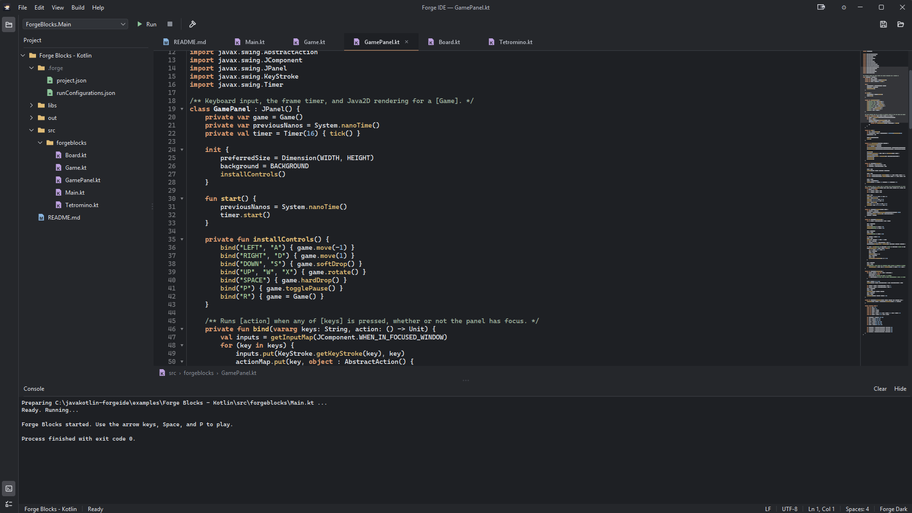

# Forge IDE

A small integrated development environment (IDE) built from scratch in Java and Kotlin
with Swing. ForgeIDE brings file editing, project navigation, compilation, and program
execution together in one lightweight window.

ForgeIDE began as a school project loosely inspired by IntelliJ IDEA (version 1.1.0 was
presented for assessment) and is now a personal project with its own direction:

> **ForgeIDE: An IDE That Knows Your Workflow.**
> It understands what you're building, adapts the tools around it, and lets you see how
> those tools actually work.

The workflow features (Game Dev first, then Swing GUI) are **planned and not yet
implemented**; see [Direction](#direction). Everything else in this README describes what
ForgeIDE does today.

FlatLaf provides the look and feel, `kotlinx.serialization` handles JSON persistence, and
JetBrains' Markdown parser powers the Markdown view. Source files are documented with
Javadoc (Java) and KDoc (Kotlin).



## Table of Contents

- [Features](#features)
- [Language Support](#language-support)
- [Getting Started](#getting-started)
- [Example Projects](#example-projects)
- [Project Structure](#project-structure)
- [Class Structure](#class-structure)
- [Settings and Project Data](#settings-and-project-data)
- [Direction](#direction)
- [Documentation](#documentation)

## Features

### Editor

- **Tabbed editor:** open multiple files, track unsaved changes, save one file or all of
  them, and undo or redo edits. Tabs show file icons and can be dragged to reorder.
- **Syntax highlighting:** language-specific lexers highlight Java and, when their plugins
  are installed, Kotlin and C++. `TODO` and `FIXME` comments are highlighted in the theme's
  colour, including continuation lines.
- **Editing aids:** bracket matching, auto-closing brackets and quotes, smart indentation
  on Return and Tab, a custom caret, and current-line and selection painting.
- **Gutter:** line numbers, code folding arrows, breakpoint toggling (visual only; there is
  no debugger yet), and markers for added and modified lines.
- **Minimap and breadcrumbs:** a minimap beside the editor (toggled under
  **Settings → General → Editor defaults**) and a breadcrumb bar showing where the current
  file sits in the project.
- **Markdown view:** `.md` files open in a Markdown tab rendered natively in Swing.
  GitHub-flavoured Markdown is parsed by JetBrains' parser, including highlighted code
  blocks; anything unsupported falls back to plain text.

### Projects and files

- **Project explorer:** create, open, and close projects; create files and folders; rename
  inline (`F2`), move (`F6` or drag and drop), and delete entries; copy paths; and reveal
  files in the system file manager. Multi-select works for open, move, copy path, and
  delete, and typing jumps to matching items (speed search).
- **File watching** keeps the tree up to date with changes made outside the IDE.
- **New file dialog** (`Ctrl+N`) offering language-specific templates. Java has class,
  interface, record, enum, annotation, exception, and compact source file; Kotlin and C++
  supply their own sets. Files created in the tree get the correct `package` line.

### Build and run

- **Build, clean, and run** supported projects, with output and standard input in the
  console, a Stop control that also stops child processes, and the real result (success,
  failure, or cancelled) with elapsed time in the status bar.
- **Java compilation** through either an external `javac` process or the in-process Java
  Compiler API, chosen per project.
- **Run configurations:** save entry points, program arguments, runtime options,
  environment variables, working directories, and before-launch behaviour.

### Workbench

- **Tool windows:** a vertical stripe toggles the Project tool window, and the bottom area
  switches between the Console and a TODO tool window. The TODO window is currently an
  empty frame; listing the project's TODOs is still to come.
- **Themes:** Material Darker, Forge Dark, Forge Light, Swing Metal, and the system look
  and feel, each with matching syntax colours.
- **Customisation:** editor font and settings, show or hide the toolbar, status bar, and
  tool windows, and reset the layout.
- **Persistent settings and session:** IDE preferences, the workbench layout, and project
  configuration are stored as JSON, with options to restore the previous project and its
  open files at startup.

## Language Support

| Language          | Availability                        | Current support                                                                                                     |
|-------------------|-------------------------------------|---------------------------------------------------------------------------------------------------------------------|
| Java              | Built into the application          | File templates, syntax highlighting, and build, clean, and run through a JDK (external `javac` or the Compiler API). |
| Kotlin            | Optional `forge-lang-kotlin` plugin | File templates, syntax highlighting, and Kotlin/JVM build and run through an external Kotlin compiler.              |
| C++               | Optional `forge-lang-cpp` plugin    | File templates, syntax highlighting, and build and run through CMake or direct `g++` compilation.                   |
| Python, Lua, Rust | Unfinished source implementations   | Not registered as available languages; their lexers and toolchains are not implemented.                             |

Language plugins are discovered at startup through Java's `ServiceLoader`. The built-in
Java provider is registered in
[`src/main/resources/META-INF/services`](src/main/resources/META-INF/services/com.willclay.forgeide.lang.api.LanguageProvider),
and external plugin JARs are loaded from `~/.forge/plugins`. A plugin can also supply its
own file templates and file icons. Restart ForgeIDE after installing a plugin. Compilers
and third-party libraries used by a project must be installed separately.

## Getting Started

### Requirements

- A full **JDK** (development uses JDK 26). A JRE is not enough, because Java compilation
  needs the JDK's tools.
- Nothing else to install for building ForgeIDE itself: the Gradle wrapper (Gradle 9.7.1)
  downloads Gradle, Kotlin 2.4.20, and the dependencies below.
- To run Kotlin projects inside ForgeIDE, an external `kotlinc` installation. To run C++
  projects, a C++ compiler (and CMake for CMake projects).

| Dependency                                | Purpose                                              |
|-------------------------------------------|------------------------------------------------------|
| FlatLaf 3.7.2, Extras, and IntelliJ Themes | Swing look and feel, themes, and SVG icons          |
| JSVG 2.2.0                                | SVG rendering used by FlatLaf Extras' icons          |
| kotlinx-serialization-json 1.11.0         | JSON settings, session, and project data             |
| JetBrains Markdown 0.7.9                  | Parsing Markdown for the Markdown view               |

### Run from source

From the repository root on Windows:

```powershell
.\gradlew.bat run
```

Use `./gradlew run` on Unix-like systems. In IntelliJ IDEA, open the repository as a
Gradle project; the root `settings.gradle.kts` includes the host application and both
language plugins.

### Build

| Gradle task          | Result                                                                                |
|----------------------|---------------------------------------------------------------------------------------|
| `build`              | Compiles everything and produces `build/libs/ForgeIDE-Fat.jar`, a runnable uber JAR.  |
| `buildAllJars`       | Packages the IDE and both language plugin JARs.                                       |
| `installPlugins`     | Builds both plugins and replaces the copies in `~/.forge/plugins`.                    |
| `syncDistLibraries`  | Makes `dist/libs` contain exactly the runtime dependencies Gradle resolved.           |

### Language plugins

The Kotlin and C++ plugins are Gradle subprojects under `modules/`. The quickest way to
install them is:

```powershell
.\gradlew.bat installPlugins
```

To build them without installing, run
`.\gradlew.bat :modules:forge-lang-kotlin:build :modules:forge-lang-cpp:build`. The JARs
are written to:

- `modules/forge-lang-kotlin/build/libs/forge-lang-kotlin-1.1.0.jar`
- `modules/forge-lang-cpp/build/libs/forge-lang-cpp-1.1.0.jar`

Copy them into `~/.forge/plugins` and restart ForgeIDE. Each JAR includes its
`LanguageProvider` service registration; ForgeIDE supplies the host classes and shared
libraries at runtime, so they are not bundled into the plugins.

### Native launchers (optional)

`native/` holds C++ and Rust Windows launchers, and `packaging/` holds scripts that build
them (`packaging/executable`), generate the application icon (`packaging/icon`), build
plugins, and create a runtime image. These are packaging work and are not needed to run
ForgeIDE from source.

## Example Projects

[`examples/Forge Runner - Java`](examples/Forge%20Runner%20-%20Java) is a small side-scrolling Java2D
platformer packaged as a Forge project. Open that directory in ForgeIDE, select
`src/forgerunner/ForgeRunner.java`, and press Run.

[`examples/Forge Blocks - Kotlin`](examples/Forge%20Blocks%20-%20Kotlin) is a falling-block
puzzle game drawn with Java2D and compiled by the Kotlin language plugin through `kotlinc`.
Its five files each lean on a different Kotlin feature (sealed states, data classes,
sequences, and a small key-binding DSL), so it doubles as a tour of what the plugin
supports. Open the directory, select `src/forgeblocks/Main.kt`, and press Run.

[`examples/Forge Strike - C++`](examples/Forge%20Strike%20-%20C%2B%2B) is a
top-down SFML arena shooter built with CMake, using procedural graphics and no
game assets. The C++ plugin detects its `CMakeLists.txt` and builds through CMake; a
project without one is compiled by invoking `g++` directly. This example requires SFML 3
and a compatible C++ compiler; see its [README](examples/Forge%20Strike%20-%20C%2B%2B/README.md)
for build instructions and controls.

## Project Structure

```text
javakotlin-forgeide/
├── src/main/
│   ├── java/com/willclay/forgeide/  Main application source (Java and Kotlin)
│   └── resources/                   Editor font, theme properties, built-in language registration
├── modules/
│   ├── forge-lang-kotlin/           Kotlin language plugin (Gradle subproject)
│   └── forge-lang-cpp/              C++ language plugin (Gradle subproject)
├── examples/                        Projects to open and run in ForgeIDE
├── docs/                            Direction, design notes, and reference material
├── packaging/                       Plugin, runtime-image, executable, and icon scripts
├── native/                          C++ and Rust Windows launcher implementations
├── build.gradle.kts                 Host application build and helper tasks
└── settings.gradle.kts              Includes the two plugin modules
```

`build/`, `out/`, and `dist/` hold generated output and are ignored by Git.

## Class Structure

Host classes live under `com.willclay.forgeide`. The application separates the Swing
interface, reusable commands, project state, filesystem access, and language toolchains.
The tree below shows each package and representative classes.

```text
com.willclay.forgeide                 Main application (src/main/java/)
├── application/                     ForgeApplication, AppDirectories, IDE settings, session, and layout models
│   └── bootstrap/                   ForgeBootstrap, LanguageDiscovery, LanguagePluginLoader, BootstrapResult
├── actions/                         ActionManager, ForgeAction, Shortcuts
│   ├── file/                        New/open/close projects and files, save, save as, save all, exit
│   ├── edit/                        UndoAction, RedoAction, TextEditAction
│   ├── build/                       RunAction, StopAction, BuildProjectAction, CleanProjectAction
│   ├── explorer/                    Create, create from template, rename, move, delete, refresh, copy path, reveal
│   ├── view/                        ToggleViewAction, ResetLayoutAction
│   ├── settings/                    OpenSettingsAction
│   ├── tools/                       OpenRunConfigAction
│   └── help/                        AboutAction
├── editor/                          EditorManager, SyntaxUndoManager
├── execution/                       ExecutionManager, RunTask, ProcessRunner
├── files/                           SourceFileIO — source text, encodings, line endings
├── filesystem/                      FileOperations, FileWatcher
├── highlighting/                    SyntaxHighlighter, TodoFinder, Token, TokenType, TokenTheme
├── json/                            JsonFileStore, JsonCodec, KotlinxJsonCodec, VersionedJsonDocument
├── lang/                            LanguageRegistry
│   ├── api/                         Language, LanguageProvider, Lexer, Toolchain, LaunchOptions, EntryPoints
│   │   ├── settings/                LanguageSettings, LanguageSettingsPage
│   │   └── templates/               FileTemplate, FileTemplates, TemplateRequest
│   ├── java/                        JavaLanguage, JavaLexer, JavacToolchain, InProcessJavaCompiler, JavaTemplates
│   ├── jvm/                         JvmSettings, JvmClassPath — shared JVM configuration
│   └── python/, lua/, rust/         Unfinished language stubs (not registered)
├── layouts/                         ColumnLayout, MinimapScrollPaneLayout
├── markdown/                        Markdown (parser bridge), MarkdownPane, MarkdownView, RichText, code/
├── services/                        ActionContext, WorkspaceService, ApplicationShutdown
│   ├── session/                     SessionService
│   └── settings/                    SettingsService, IDESettingsRuntime
│       ├── project/                 ProjectSettingsService, ProjectSettingsValues
│       └── theme/                   ThemeService, AppTheme, ForgeDarkLaf
├── workspace/                       Workspace, Project, ProjectItem, WorkspaceListener
│   ├── metadata/                    ProjectMetadata, ProjectConfiguration, encoding/, lineseparators/
│   └── runconfig/                   RunConfiguration, RunConfigurationManager, RunConfigurationsStore
├── ui/                              Window, WorkbenchPanel, ToolWindowHeader, Utils
│   ├── editor/                      CodeEditorPanel, EditorTab, EditorTabHeader, ForgeEditorPane, ForgeCaret,
│   │                                SelectionPainter, BracketMatcher, SmartTyping, FoldingModel, Minimap,
│   │                                EditorBreadcrumb, ConsolePanel, EditorEmptyState
│   │   └── markdown/                MarkdownTab
│   ├── explorer/                    ProjectTree, ProjectTreeModel, ProjectTreeRenderer, ProjectTreeTransferHandler,
│   │                                TreeSpeedSearch, ProjectContextMenu
│   ├── menu/                        EditorMenuBar, FileMenu, EditMenu, BuildMenu, ViewMenu, HelpMenu
│   ├── toolbar/                     EditorToolBar, EditorSideBar
│   │   └── runconfigurations/       RunConfigurationDropdown, RunConfigurationDialog
│   ├── todo/                        TodoPanel
│   ├── statusbar/                   StatusBar
│   ├── gutter/                      TabGutter, BreakpointModel, LineChangeTracker
│   ├── dialogs/                     FileDialogs, NewFileDialog, EntryPointChooser
│   ├── icons/                       AppIcons, FileIcons
│   ├── fonts/                       EditorFonts
│   └── settings/                    SettingsWindow, SettingsDialogController, general/, project/, theme/
├── annotations/                     SourceEquivalent — links Kotlin classes to Java reference versions
└── Main.java                        Entry point

com.willclay.forgeide.lang.kotlin     Optional plugin (modules/forge-lang-kotlin/src/main/)
├── KotlinLanguageProvider.kt        Plugin entry point
├── KotlinLanguage.kt                Language definition
├── KotlinTemplates.kt               New-file templates
├── KotlinLexer.kt                   Syntax tokens
├── KotlincToolchain.kt              Compile, build, clean, and run Kotlin/JVM projects
├── KotlinClassNames.kt              Class names, source/output paths, classpath helpers
├── KotlinSettings.java              Kotlin compiler and JVM settings
└── KotlinSettingsPage.java          Settings UI

com.willclay.forgeide.lang.cpp        Optional plugin (modules/forge-lang-cpp/src/main/)
├── CppLanguageProvider.java         Plugin entry point
├── CppLanguage.java, CppTemplates   Language definition and new-file templates
├── CppLexer.java                    Syntax tokens
├── CppToolchain.java                Compile, build, clean, and run C++ projects
├── CppBuildSystem, CppBuilder       Build system selection and shared builder interface
├── CMakeBuilder, GppBuilder         CMake builds and direct g++ builds
├── CppSettings, CMakeSettings,      Project, CMake, and compiler/linker settings
│   GppSettings, CppSettingsPage     and their settings UI
└── CppSources, CppProcesses, CppJson  Source discovery, process and JSON helpers
```

| Area               | Main classes                                                                                       | Responsibility                                                                  |
|--------------------|----------------------------------------------------------------------------------------------------|---------------------------------------------------------------------------------|
| Startup            | `Main`, `ForgeBootstrap`, `LanguageDiscovery`, `LanguagePluginLoader`                              | Load settings and languages, then start the Swing interface.                    |
| UI assembly        | `Window`, `WorkbenchPanel`, `ActionContext`                                                        | Construct the components and connect them to the services and actions they use. |
| Commands           | `ActionManager`, `ForgeAction`, classes under `actions/`                                           | Share commands between menus, toolbars, shortcuts, and context menus.           |
| Editor             | `EditorManager`, `CodeEditorPanel`, `EditorTab`, `ForgeEditorPane`, `SyntaxUndoManager`            | Coordinate open documents, tabs, modified state, saving, and undo history.      |
| Editor surface     | `ForgeEditorPane`, `ForgeCaret`, `SelectionPainter`, `BracketMatcher`, `FoldingModel`, `TabGutter`, `Minimap` | Draw the caret, selection, current line, brackets, folds, gutter, and minimap. |
| Typing             | `SmartTyping`                                                                                      | Close brackets and quotes, step over them, and indent on Return and Tab.        |
| Projects and files | `Workspace`, `Project`, `WorkspaceService`, `FileOperations`, `FileWatcher`, `SourceFileIO`        | Represent projects and coordinate filesystem operations and file contents.      |
| Highlighting       | `SyntaxHighlighter`, `TodoFinder`, `Token`, `TokenType`, `TokenTheme`, `Lexer`                     | Turn language tokens into styled editor text.                                   |
| Execution          | `ExecutionManager`, `RunTask`, `ProcessRunner`                                                     | Track active work, run external processes, and support stopping them.           |
| Language API       | `LanguageRegistry`, `LanguageProvider`, `Language`, `Toolchain`, `FileTemplates`                   | Discover languages and expose templates, icons, lexers, and build/run behaviour. |
| Persistence        | `SettingsService`, `SessionService`, `ProjectMetadata`, `RunConfigurationsStore`, `JsonFileStore`, `KotlinxJsonCodec` | Read and write IDE and project configuration.                      |

[`Window`](src/main/java/com/willclay/forgeide/ui/Window.java) is the main assembly point: it creates
the workbench and services, builds an `ActionContext`, and passes that context to
[`ActionManager`](src/main/java/com/willclay/forgeide/actions/ActionManager.kt). Menus and toolbars
receive the same Action instances, which keeps their enabled state synchronised.

For example, Run follows this path:

```text
Menu or toolbar
    -> shared RunAction
    -> RunTask managed by ExecutionManager
    -> selected language's Toolchain
    -> compiler/program output displayed in ConsolePanel
```

The language API lets a plugin supply a compiler, lexer, templates, or icons without adding
language-specific logic to the Swing components. Swing updates belong on the Event Dispatch
Thread, while compilation and process execution run in background tasks.

## Settings and Project Data

| Path                                      | Contents                                                          |
|-------------------------------------------|-------------------------------------------------------------------|
| `~/.forge/config/settings.json`           | IDE-wide preferences, including editor and theme settings.        |
| `~/.forge/config/session.json`            | Last project, open files, and workbench layout for startup.       |
| `~/.forge/plugins/`                       | External language plugin JARs loaded at startup.                  |
| `<project>/.forge/project.json`           | Project metadata, file handling, and language settings.           |
| `<project>/.forge/runConfigurations.json` | Saved run configurations for that project.                        |

Here, `~` means the user's home directory. Global settings and project settings have
separate scopes, so changing one project's compiler or source paths does not change
every other project.

## Direction

ForgeIDE's next phase is about **workflows**: Forge recognises the kind of project you're
building and adds tools for it. Each workflow helps you prototype quickly, see the real
code behind the prototype, and then graduate to writing that code yourself.

- **Game Dev** (first): a small sketch/game runtime on Java2D with a Kotlin DSL,
  run-on-save feedback, and raylib templates for C++.
- **Swing GUI** (second): an ASCII UI editor that generates readable Swing code.

Detection will be automatic, rule-based, and explainable, and a project can have several
workflows at once. None of this is implemented yet; see
[`docs/direction/`](docs/direction/markdown/) for the design notes.

## Documentation

Start with the Javadoc and KDoc beside the source: these describe class responsibilities,
method contracts, and the reasons behind design choices. A useful reading order is
`Main` → `ForgeBootstrap` → `Window` → `ActionManager`, then the service or language
implementation for the feature you want to explore.

- [`CHANGELOG.md`](CHANGELOG.md) lists changes by release.
- [`docs/direction/`](docs/direction/markdown/) describes where ForgeIDE is heading.
- [`docs/markdown/`](docs/markdown/) contains development notes on systems such as
  [startup](docs/markdown/BootstrapSequence.md),
  [run configurations](docs/markdown/RunConfigurations.md),
  [syntax highlighting](docs/markdown/Per-FileSyntaxHighlighting.md),
  [language settings](docs/markdown/LanguageSettings.md), and the
  [kotlinx.serialization migration](docs/markdown/KotlinxSerializationMigration.md).
- [`docs/java-equivalents/`](docs/java-equivalents/) contains Java reference versions
  of selected Kotlin classes. `@SourceEquivalent` annotations link Kotlin implementations
  to these files; the reference versions are not compiled as application source.
- [`docs/html/`](docs/html/) contains component reference pages used during UI development.
- [`docs/IntelliJRepositoryBreakdown.md`](docs/IntelliJRepositoryBreakdown.md) records
  architectural research into IntelliJ IDEA.

Some design notes describe earlier implementations or proposed features. Use the current
source and the feature list above when checking what ForgeIDE implements today.
