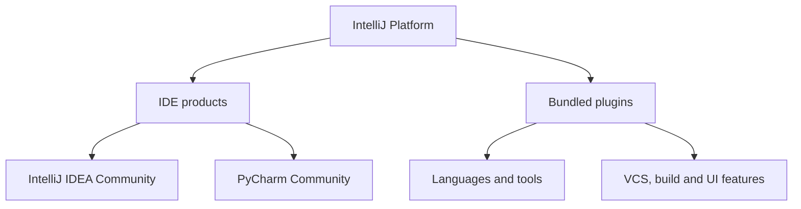
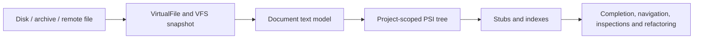

# IntelliJ Open-Source Repository: Architecture and Codebase Deep Dive

**Snapshot analysed:** JetBrains/intellij-community `master` at commit [`c2a311eeb1c112d641193394b8054c643e311068`](https://github.com/JetBrains/intellij-community/tree/c2a311eeb1c112d641193394b8054c643e311068), 
committed 20 August 2026 UTC and analysed 21 August 2026 (Australia/Hobart).

## Executive summary

The first important correction is that `intellij-community` is no longer best understood as merely “the source code for IntelliJ IDEA Community Edition.” JetBrains describes it as the open-source part of its IDE codebase and the 
basis of IntelliJ Platform development. The same monorepo contains the open-source IntelliJ IDEA and PyCharm product layers, the shared platform, Java/Kotlin/Python language support, bundled plugins, build infrastructure, native helpers, 
remote-development code, and a very large test corpus. Some Android modules are fetched from separate repositories, and proprietary Ultimate-only code is not present. 
See the repository's [README](https://github.com/JetBrains/intellij-community/blob/c2a311eeb1c112d641193394b8054c643e311068/README.md).

For the pinned snapshot:

- **279,629 tracked files** exist in the Git tree.
- After removing tests, test data, build/run/configuration sources, generated roots, examples, and path-signalled vendored sources, **64,781 production source files** remain.
- Those files contain **7,654,144 physical lines** and approximately **5,934,237 nonblank, noncomment code lines**.
- Java contributes about **3.25 million code lines** and Kotlin about **2.21 million**. Together they account for roughly 92% of the filtered code.
- The largest source area is `platform` at **40.33%** of filtered code, followed by `plugins` at **29.27%**, `java` at **15.09%**, and `python` at **9.45%**.
- The repository contains approximately **47,974 Java named type declarations** and more than **50,000 Kotlin named class/interface/object/type-alias declarations**, before counting Kotlin companion objects.

The architectural lesson is not “large applications need thousands of classes.” It is that large applications need a small number of dependable boundaries: scoped services, explicit lifetimes, a central document/file model, 
strict threading rules, lazy loading, replaceable extensions, cancellable background work, and derived caches that can be rebuilt. IntelliJ's scale is mostly many features composed on those foundations.

## 1. Measurement scope and methodology

### What was included

The analysis considered source-like files in these language groups:

- Java, Kotlin, Python and Python stubs
- JavaScript and TypeScript
- C, C++, Objective-C and Objective-C++
- Groovy, Rust, Go and Ruby
- shell, PowerShell and batch scripts that were not recognised as root-level build/run launchers

### What was excluded

The code metrics intentionally exclude:

- paths conventionally used for tests or fixtures, including `test`, `tests`, `testData`, `testSrc`, `testSources`, `testFramework`, `testEntities`, `testGen`, `testResources`, `testing`, and common spelling variants;
- test-looking filenames such as `*Test`, `*Tests`, `*TestCase`, `test_*`, `*_test`, `conftest.py`, and `tests.py`;
- root build/tool/config areas such as `.idea`, `.github`, `build`, `tools`, `lib`, `libraries`, `docs`, and root launcher scripts;
- generated/output roots such as `gen`, `generated`, `out`, `dist`, and `target`;
- examples, samples, demos, benchmarks, node modules, third-party and path-signalled vendor directories;
- configuration/resource languages such as XML, JSON, YAML, properties, `.iml`, Bazel/Starlark, Gradle scripts and Markdown.

This is therefore a count of **production programming-language source**, not every text line shipped in the repository. The filtering is intentionally conservative. A bundled JavaScript library stored in an ordinary production 
resource path may still be counted, while JetBrains-authored code placed in a directory named `testing` may be excluded.

### How the numbers were calculated

- **Physical lines** are all lines returned by normal Unicode text line splitting.
- **Code lines** are nonblank lines after removing comments and string contents with a language-family-aware lexical pass.
- **Declaration counts** are lexical matches over comment/string-stripped source, not compiler AST counts.
- Anonymous Java classes are not counted because they have no named `class` declaration.
- Declarations inside generated code that escaped the path filter can still be counted.
- C/C++ macros and unusual syntax can produce small declaration-count errors.

The exact commit makes the result reproducible. Future `master` revisions will differ.

GitHub's repository-wide Linguist view provides a useful comparison, but it answers a different question because it includes tests and other tracked sources. At analysis time it reported approximately 
Java 46.7%, Kotlin 35.6%, Python 8.4%, JavaScript 5.3%, Starlark 1.7%, HTML 1.3%, and other languages 1%. See the [repository overview](https://github.com/JetBrains/intellij-community).

## 2. Production code statistics by language

| Language        |      Files |  Physical LOC |      Code LOC | Share of code LOC |
|-----------------|-----------:|--------------:|--------------:|------------------:|
| Java            |     34,525 |     4,137,087 |     3,245,414 |            54.69% |
| Kotlin          |     27,742 |     2,800,936 |     2,206,981 |            37.19% |
| JavaScript      |        258 |       271,998 |       191,441 |             3.23% |
| Python          |      1,869 |       281,444 |       175,089 |             2.95% |
| C/C++           |         92 |       129,780 |        92,792 |             1.56% |
| TypeScript      |        131 |        10,188 |         8,630 |             0.15% |
| Rust            |         14 |         7,609 |         4,009 |             0.07% |
| Go              |         25 |         3,143 |         2,748 |             0.05% |
| Shell           |         45 |         3,176 |         2,154 |             0.04% |
| Objective-C/C++ |          8 |         2,781 |         2,126 |             0.04% |
| PowerShell      |          4 |         2,459 |         1,717 |             0.03% |
| Groovy          |         55 |         2,801 |           528 |             0.01% |
| Batch           |         11 |           621 |           511 |             0.01% |
| Ruby            |          2 |           121 |            97 |            <0.01% |
| **Total**       | **64,781** | **7,654,144** | **5,934,237** |          **100%** |

Two subtleties are worth noticing:

1. Kotlin is already a first-class implementation language, but Java remains larger in this production-only snapshot. This is an evolutionary codebase rather than a Kotlin rewrite.
2. The `python` repository root contains substantial Java and Kotlin implementation code for PyCharm. “Directory named Python” and “files written in Python” are not equivalent.

## 3. Type and class declarations by language

| Language        |                                                       Class-like declarations |         Interfaces / traits |              Enums | Records | Other named type declarations                                     |
|-----------------|------------------------------------------------------------------------------:|----------------------------:|-------------------:|--------:|-------------------------------------------------------------------|
| Java            |                                                                39,163 classes |            6,867 interfaces |              1,158 |     622 | 164 annotation interfaces                                         |
| Kotlin          | 30,094 ordinary classes; 6,210 data classes; 220 value classes; 5,137 objects |            6,874 interfaces | 1,782 enum classes |       — | 196 annotation classes; 388 type aliases; 7,407 companion objects |
| Python          |                                                                 4,051 classes |                           — |                  — |       — | —                                                                 |
| JavaScript      |                                                                   201 classes |                           — |                  — |       — | —                                                                 |
| TypeScript      |                                                                    30 classes |              158 interfaces |                  0 |       — | 27 type aliases                                                   |
| C/C++           |                                                     53 classes; 1,001 structs |                           — |                 11 |       — | 0 unions matched                                                  |
| Rust            |                                                                    21 structs |                     1 trait |                  2 |       — | 10 type aliases; 0 unions matched                                 |
| Go              |                                                                    13 structs |        0 interfaces matched |                  — |       — | 0 aliases matched                                                 |
| Groovy          |                                                                    48 classes | 0 interfaces/traits matched |                  0 |       0 | —                                                                 |
| Objective-C/C++ |                                                                     2 structs |                           — |                  1 |       — | —                                                                 |

No meaningful type-declaration grammar was counted for shell, PowerShell, batch or Ruby in this pass.

For Java alone, the measured categories total **47,974 named types**. For Kotlin, the named class/interface/enum/annotation/object/type-alias categories total **50,901**, or **58,308 declarations** if companion objects are also counted. 
These figures explain why navigating IntelliJ by “reading all the classes” is not realistic. The productive unit of study is a subsystem and its contracts.

## 4. Repository anatomy

### Major roots by filtered code volume

| Root        |  Code LOC |  Share | Primary responsibility                                                                                                                                                                            |
|-------------|----------:|-------:|---------------------------------------------------------------------------------------------------------------------------------------------------------------------------------------------------|
| `platform`  | 2,392,994 | 40.33% | Product-neutral IDE runtime: application/project lifecycle, services, editor, VFS, PSI foundations, indexing, UI, actions, execution, VCS APIs, persistence and remote-development infrastructure |
| `plugins`   | 1,736,711 | 29.27% | Bundled features and integrations: Kotlin, Gradle, Maven, Git, GitHub/GitLab, terminal, Markdown, YAML, Groovy, JUnit/TestNG, DevKit, settings sync and many others                               |
| `java`      |   895,383 | 15.09% | Java PSI, parser/syntax, analysis, inspections, refactoring, debugger/compiler integration, Java UI and runtime support                                                                           |
| `python`    |   560,522 |  9.45% | PyCharm Community functionality: Python PSI/parser, type engine, SDK/interpreter/package management, debugger helpers, inspections and tooling integrations                                       |
| `xml`       |    97,629 |  1.65% | XML language model, DOM support and related code insight                                                                                                                                          |
| `grid`      |    53,391 |  0.90% | Newer distributed/client-server platform infrastructure                                                                                                                                           |
| `fleet`     |    50,221 |  0.85% | Shared frontend/remote-development-related infrastructure                                                                                                                                         |
| `jps`       |    48,986 |  0.83% | JetBrains Project System model and external build-process support                                                                                                                                 |
| `json`      |    24,015 |  0.40% | JSON language support and schema-aware features                                                                                                                                                   |
| `uast`      |    19,450 |  0.33% | Unified AST abstractions across JVM languages                                                                                                                                                     |
| `native`    |    14,880 |  0.25% | OS/native helpers and launch/integration code                                                                                                                                                     |
| `jvm`       |    10,156 |  0.17% | Cross-JVM-language functionality                                                                                                                                                                  |
| Other roots |    29,899 |  0.50% | Regex, notebooks, updater, spellchecker, Jupyter, command interfaces and small support areas                                                                                                      |

The filtered source-file counts tell the same story: `platform` contains 26,895 files, `plugins` 19,878, `java` 7,839, and `python` 5,805. The scan also found **1,203 non-test `.iml` files** and **125 non-test `plugin.xml` descriptors**. 
Those are not perfect counts of runtime modules or products, but they show how aggressively the codebase is partitioned.

### Platform versus product versus plugin

The repository is easiest to understand in three layers:

- **Platform** supplies reusable IDE mechanisms. It should not need to know every language or product feature.
- **Product assembly** selects platform modules, bundled plugins, branding and product-specific configuration.
- **Plugins/content modules** provide languages, build systems, version control, UI features and integrations through declared dependencies and extension points.

This is closer to an operating platform for IDE features than to a conventional desktop program organised around one `MainWindow` class.

## 5. Core architectural mechanisms

### 5.1 Bootstrap and service container

Startup begins in bootstrap code, loads product and plugin descriptors, creates the application container, then lazily instantiates services and extensions as required. Useful source landmarks include:

- [`ApplicationLoader.kt`](https://github.com/JetBrains/intellij-community/blob/c2a311eeb1c112d641193394b8054c643e311068/platform/platform-impl/bootstrap/src/com/intellij/platform/ide/bootstrap/ApplicationLoader.kt)
- [`ApplicationImpl.java`](https://github.com/JetBrains/intellij-community/blob/c2a311eeb1c112d641193394b8054c643e311068/platform/platform-impl/src/com/intellij/openapi/application/impl/ApplicationImpl.java)
- [`ComponentManagerImpl.kt`](https://github.com/JetBrains/intellij-community/blob/c2a311eeb1c112d641193394b8054c643e311068/platform/service-container/src/com/intellij/serviceContainer/ComponentManagerImpl.kt)
- [`PluginManagerCore.kt`](https://github.com/JetBrains/intellij-community/blob/c2a311eeb1c112d641193394b8054c643e311068/platform/core-impl/src/com/intellij/ide/plugins/PluginManagerCore.kt)

Services have application, project or module scope and are loaded on demand. Project scope means one instance per open project; application scope means one shared instance for the IDE process. JetBrains specifically recommends avoiding 
heavy service constructors and avoiding module-level services where project scope is enough because per-module instances can multiply memory usage. See [Services](https://plugins.jetbrains.com/docs/intellij/plugin-services.html).

The important idea is scoped ownership, not dependency injection for its own sake. A project service can safely own project-specific state because its lifetime ends with the project.

### 5.2 Extensions, plugins and listeners

An **extension point** is a contract owned by the platform or another plugin. Implementations are declared by plugins and instantiated lazily. This reverses the normal dependency direction: core code depends on a small interface, not on every 
future language, VCS or tool-window implementation.

`ExtensionPointImpl.kt` and the plugin descriptors implement the machinery, while public extension-point lists document the available contracts. Declarative listeners are also created lazily, which improves startup time. 
See [Extension points and listeners](https://plugins.jetbrains.com/docs/intellij/intellij-platform-extension-point-list.html) and [Listeners](https://plugins.jetbrains.com/docs/intellij/plugin-listeners.html).

The message bus provides typed publish/subscribe topics at application and project levels. Connections can be attached to a disposable lifetime, preventing a project listener from being retained by an application-level publisher after the project 
closes. See [Messaging Infrastructure](https://plugins.jetbrains.com/docs/intellij/messaging-infrastructure.html) 
and [`MessageBusImpl.kt`](https://github.com/JetBrains/intellij-community/blob/c2a311eeb1c112d641193394b8054c643e311068/platform/core-api/src/com/intellij/util/messages/impl/MessageBusImpl.kt).

### 5.3 Explicit lifetime management

Desktop applications keep projects, editors, listeners, caches and background tasks alive for a long time. Garbage collection cannot solve logical ownership when a listener or callback still holds a reference.

IntelliJ therefore uses `Disposable`/`Disposer` trees and, increasingly, coroutine scopes tied to the same lifetimes. Closing a project or editor can cancel child work and release subscriptions as one ownership operation. [`Disposer.java`](https://github.com/JetBrains/intellij-community/blob/c2a311eeb1c112d641193394b8054c643e311068/platform/util/src/com/intellij/openapi/util/Disposer.java) is a small class with enormous architectural importance.

### 5.4 Project and workspace model

The older project model exposed modules, libraries, facets and roots through separate services. Workspace Model introduces a unified, platform-independent entity store backed by persistent data structures and immutable snapshots. This makes bulk changes, snapshots and cross-process reuse more tractable. See [Workspace Model](https://plugins.jetbrains.com/docs/intellij/workspace-model.html) and [`WorkspaceModelImpl.kt`](https://github.com/JetBrains/intellij-community/blob/c2a311eeb1c112d641193394b8054c643e311068/platform/projectModel-impl/src/com/intellij/workspaceModel/ide/impl/WorkspaceModelImpl.kt).

This is a production-scale solution to a problem Forge will eventually face: project configuration is not merely a folder path. It becomes a graph of modules, source roots, libraries, SDKs, generated roots, exclusions and build-system ownership.

### 5.5 VFS, Document, PSI and indexes

This is the heart of IntelliJ's language-aware design:

- **Virtual File System:** presents a uniform file API and maintains an application-level persistent snapshot. File watcher events trigger refreshes rather than directly replacing the model. See [Virtual File System](https://plugins.jetbrains.com/docs/intellij/virtual-file-system.html) and [`VirtualFileManagerImpl.java`](https://github.com/JetBrains/intellij-community/blob/c2a311eeb1c112d641193394b8054c643e311068/platform/core-impl/src/com/intellij/openapi/vfs/impl/VirtualFileManagerImpl.java).
- **Document:** is the editable Unicode text sequence. It normalises line breaks and participates in commands/undo. Documents are created on demand and weakly referenced when unmodified. See [Documents](https://plugins.jetbrains.com/docs/intellij/documents.html) and [`DocumentImpl.java`](https://github.com/JetBrains/intellij-community/blob/c2a311eeb1c112d641193394b8054c643e311068/platform/core-impl/src/com/intellij/openapi/editor/impl/DocumentImpl.java).
- **Editor:** is a view/controller over a document, adding caret, selections, folding, soft wraps, inlays, rendering and interaction. Multiple editors can show the same document. [`EditorImpl.java`](https://github.com/JetBrains/intellij-community/blob/c2a311eeb1c112d641193394b8054c643e311068/platform/platform-impl/src/com/intellij/openapi/editor/impl/EditorImpl.java) is a useful landmark, but language intelligence should not be confused with this painting layer.
- **PSI:** is a project-scoped syntactic/semantic tree produced by a language's parser definition. The same `VirtualFile` may have different `PsiFile` instances in different projects. See [PSI Files](https://plugins.jetbrains.com/docs/intellij/psi-files.html) and [`PsiManagerImpl.java`](https://github.com/JetBrains/intellij-community/blob/c2a311eeb1c112d641193394b8054c643e311068/platform/core-impl/src/com/intellij/psi/impl/PsiManagerImpl.java).
- **Stubs and indexes:** retain compact, queryable information so navigation and completion do not require parsing every file for every request. Indexing creates “dumb mode,” during which features that need indexes must wait, degrade gracefully or declare themselves dumb-aware. See [Indexing and PSI Stubs](https://plugins.jetbrains.com/docs/intellij/indexing-and-psi-stubs.html) and [`FileBasedIndexImpl.java`](https://github.com/JetBrains/intellij-community/blob/c2a311eeb1c112d641193394b8054c643e311068/platform/lang-impl/src/com/intellij/util/indexing/FileBasedIndexImpl.java).

Edits travel in both directions: document edits invalidate/rebuild PSI and indexes; PSI refactorings generate document changes inside commands/write actions; saving synchronises documents back through the VFS to storage.

### 5.6 Threading, cancellation and responsiveness

Swing has one Event Dispatch Thread, but an IDE performs parsing, indexing, VCS operations, builds and process I/O concurrently. IntelliJ protects major data models with an application-wide read/write discipline. Expensive reads should be 
backgroundable and cancellable; writes occur in write-safe contexts; UI work stays on the EDT. Newer Kotlin code increasingly uses coroutine dispatchers and cancellable read actions. 
See [Threading Model](https://plugins.jetbrains.com/docs/intellij/threading-model.html) and [Coroutine Read Actions](https://plugins.jetbrains.com/docs/intellij/coroutine-read-actions.html).

This leads to a critical production rule: a background result is provisional. Before applying it, code must check cancellation, project disposal, file validity and whether the document has changed since the computation started.

### 5.7 Action system and UI composition

Menus, toolbars, shortcuts and context menus are built from reusable actions and action groups. An action's presentation can be updated for the current context, while its execution should delegate to services rather than becoming the service 
itself. JetBrains explicitly recommends extracting owned logic instead of programmatically invoking another action. See [Action System](https://plugins.jetbrains.com/docs/intellij/action-system.html) 
and [`ActionManagerImpl.kt`](https://github.com/JetBrains/intellij-community/blob/c2a311eeb1c112d641193394b8054c643e311068/platform/platform-impl/src/com/intellij/openapi/actionSystem/impl/ActionManagerImpl.kt).

The UI remains Swing-based, but it is not raw `JFrame`/`JPanel` code everywhere. Tool windows, editor tabs, dialogs, popups, data contexts, actions, navigation and custom components form higher-level frameworks. Custom painting exists, 
especially in the editor, but syntax analysis is not embedded directly into `paintComponent()`.

### 5.8 Build, run and debug

There are two different “build systems” to keep separate:

1. **Building IntelliJ itself.** The repository is migrating to Bazel; the README says built-in IDE-only building is no longer supported. Current repository guidance also says `.iml` module files are the source of truth from which Bazel 
                                 files are generated. See [README](https://github.com/JetBrains/intellij-community/blob/c2a311eeb1c112d641193394b8054c643e311068/README.md) 
                                 and [AGENTS.md](https://github.com/JetBrains/intellij-community/blob/c2a311eeb1c112d641193394b8054c643e311068/AGENTS.md).
2. **IntelliJ building and running a user's project.** JPS, Gradle, Maven and other integrations import project models, launch external build processes and report diagnostics back to the IDE.

Execution is also layered. A persisted `RunConfiguration` is a kind of `RunProfile`; it creates a `RunProfileState`; an `Executor` selects Run/Debug/Coverage behaviour; a `ProgramRunner` coordinates execution; an `ExecutionEnvironment`
aggregates context; and the result supplies a process handler and console. See [Execution](https://plugins.jetbrains.com/docs/intellij/execution.html) 
and [`RunManagerImpl.kt`](https://github.com/JetBrains/intellij-community/blob/c2a311eeb1c112d641193394b8054c643e311068/platform/execution-impl/src/com/intellij/execution/impl/RunManagerImpl.kt).

The intermediate state object is especially valuable: extensions can patch environment variables, command lines and “before launch” work without rewriting the configuration model.

### 5.9 Persistence

Settings are normally owned by application- or project-scoped services implementing a persistent-state contract. Extensions do not persist themselves; they delegate state to a service. This separates lifecycle, validation and serialization 
from UI panels. See [Persisting State of Components](https://plugins.jetbrains.com/docs/intellij/persisting-state-of-components.html).

### 5.10 Frontend/backend split

Modern IntelliJ Platform development must also support split mode: a frontend process owns latency-sensitive UI, while a backend process owns project-local files, PSI, indexes, execution and other heavy state. Shared modules define serializable 
DTOs and RPC interfaces. A monolithic IDE can load both sides in one process. See [Split Mode](https://plugins.jetbrains.com/docs/intellij/split-mode-and-remote-development.html), 
[Frontend/Backend/Shared APIs](https://plugins.jetbrains.com/docs/intellij/frontend-backend-shared-apis.html), and [Modular Plugins](https://plugins.jetbrains.com/docs/intellij/modular-plugins.html).

This explains newer roots and module names such as `platform-frontend`, `backend`, `grid` and `fleet`. It is an important architectural direction, but far beyond what Forge needs today.

## 6. What makes the codebase production-ready

The production qualities are distributed rather than located in one framework:

- **Lazy creation:** services, listeners, documents and PSI structures are created only when needed.
- **Explicit ownership:** projects, editors, message-bus connections and coroutine scopes have parent lifetimes.
- **Derived-state discipline:** PSI, stubs, indexes and caches can be invalidated and recomputed.
- **Cancellation:** expensive reads yield to user edits and write actions.
- **Graceful degradation:** dumb-aware features continue working while indexing is incomplete.
- **Thread contracts:** APIs state whether they require EDT, background thread, read action or write action.
- **Stable extension seams:** core modules expose contracts while plugins supply optional implementations.
- **Thin actions:** UI commands discover context and delegate to domain services.
- **Persistence boundaries:** settings state is separate from settings UI.
- **Localisation:** user-visible strings are stored in resource bundles rather than scattered through implementation code.
- **Compatibility discipline:** public, internal, experimental and scheduled-for-removal APIs are distinguished.
- **Observability and failure isolation:** logging, performance metrics, plugin boundaries and process handlers make failures diagnosable.

The sheer test corpus matters as much as the production architecture, even though it was excluded from the LOC totals. The raw repository contains 91,524 Java files and 81,247 Kotlin files before filtering, compared with 34,525 and 
27,742 respectively in the production set. Test source, generated fixtures and expected-output data are therefore a major part of the repository's scale.

## 7. ForgeIDE: similarities and practical ideas to adopt

Forge already has several IntelliJ-shaped ideas:

| Forge direction                                     | IntelliJ analogue                                                       |
|-----------------------------------------------------|-------------------------------------------------------------------------|
| `ActionManager` and contextual menu actions         | Action system and data context                                          |
| `Project`, `.forge` metadata and project settings   | Project/workspace model and project persistence                         |
| `EditorManager`, tabs, highlighter and undo manager | File editor manager, editors, documents and command/undo infrastructure |
| `Language`, `Lexer`, `Toolchain` plugin concept     | Language plugins, parser/PSI services and build integrations            |
| `ExecutionManager` and run configurations           | Execution API, run profiles, runners and process handlers               |
| Theme/settings services                             | Application services and persistent state components                    |
| Project tree and file watcher                       | Project view over VFS/project file indexes                              |

### Best ideas to adopt soon

1. **Make `Document` the source of editable text.** An editor tab should be a view over a document, not the owner of file text, undo history and language state. This makes split views, reopening tabs and non-editor changes much easier.
2. **Define application and project service scopes.** Theme/settings are application scoped; project model, build, run and language services are project scoped. Close the project and close all project services.
3. **Use explicit lifetimes.** A small `Disposable`, `Scope` or `AutoCloseable` tree can own listeners, watchers and tasks. This directly prevents the stale-listener and leaked-editor class of bugs.
4. **Keep actions thin.** `RunAction` should validate UI context and call `ExecutionService`; it should not compile, launch, parse output and manage consoles itself.
5. **Separate file, document and language models.** A `Path`/virtual file answers storage questions, `Document` answers text/edit questions, and a language model answers syntax/symbol questions.
6. **Use capability-oriented language support.** Instead of requiring every plugin to implement everything, expose optional `Lexer`, `DiagnosticProvider`, `CompletionProvider`, `BuildProvider`, `RunConfigurationType` and `Formatter` capabilities.
7. **Introduce a prepared execution state.** Convert persisted configuration into a validated command/environment/working-directory state, then let before-launch tasks and language plugins patch it before a process runner starts it.
8. **Add background-task cancellation and version checks.** A syntax or diagnostic result should carry the document modification version it analysed. Drop it if the document has since changed.
9. **Use a small typed event bus.** Project-opened, document-changed, theme-changed and process-state events are enough initially. Bind subscriptions to a project/editor lifetime.
10. **Separate state from settings UI.** Your JSON records/services should be authoritative; Swing panels should edit a working copy and apply validated changes.

### Ideas not to copy yet

- A full PSI hierarchy, stub-index framework or Workspace Model entity store
- XML extension-point registration for everything
- Thousands of modules or interfaces created only to mirror IntelliJ names
- Frontend/backend RPC and remote-development separation
- JPS-like external build infrastructure before Java compilation and run configurations are stable
- Custom Swing painting where ordinary components and a clean document/highlighter model are sufficient

For Forge's school-project stage, the right target is not “mini IntelliJ.” It is a coherent small IDE whose boundaries would allow IntelliJ-like features later.

### A realistic Forge progression

**Stage 1 — strong foundations now**

- application/project service scopes;
- `DocumentManager` and document-backed tabs;
- thin actions and one `ExecutionManager`;
- project-owned language/toolchain services;
- JSON settings with validation and versioning;
- cancellable background tasks and EDT-safe UI application.

**Stage 2 — useful IDE intelligence**

- per-file parse result or lightweight AST;
- diagnostics and outline symbols;
- a simple project symbol index rebuilt incrementally;
- completion providers using that index;
- console output parsing and clickable diagnostics;
- source-root/library/module modelling.

**Stage 3 — post-school platform work**

- plugin discovery and optional capabilities;
- immutable project-model snapshots;
- stub-like serialized symbol data;
- multiple modules/languages per project;
- debugger integration;
- richer Kotlin/coroutine use for background services.

## 8. Suggested reading path through the repository

Trying to read by folder alphabetically will be frustrating. A better path is:

1. Read the repository [README](https://github.com/JetBrains/intellij-community/blob/c2a311eeb1c112d641193394b8054c643e311068/README.md) and root [AGENTS.md](https://github.com/JetBrains/intellij-community/blob/c2a311eeb1c112d641193394b8054c643e311068/AGENTS.md) to understand current build/module conventions.
2. Study service scope and disposal: `ComponentManagerImpl`, Services documentation and `Disposer`.
3. Trace one file through `VirtualFile` → `DocumentImpl` → `PsiManagerImpl` → indexes.
4. Trace one user command through `ActionManagerImpl` into a service.
5. Trace one run configuration through `RunManagerImpl`, `RunProfileState`, runner and process handler.
6. Pick one bounded plugin—JSON, Markdown or spellchecker—and identify its descriptor, services, extension points, language model and UI.
7. Only then inspect large language implementations such as Java or Kotlin.

The JSON plugin is particularly relevant to Forge: it is large enough to demonstrate real language-plugin structure but far smaller than Java support.

## Final conclusion

IntelliJ's repository is huge, but its architecture is not mysterious. It repeatedly applies a handful of rules:

- own state at the correct application/project/editor lifetime;
- model files, text and syntax as different layers;
- expose contracts and load implementations lazily;
- perform expensive work in cancellable background tasks;
- protect mutable models with explicit threading rules;
- keep UI actions and settings panels as adapters;
- treat indexes and caches as disposable derived state;
- make incomplete states—loading, indexing, disconnected, disposed—normal states the code must handle.

Those are exactly the ideas worth carrying into Forge. The impressive part of IntelliJ is not that it has tens of thousands of types; it is that those types can be developed by many teams without every feature needing to 
understand the entire application.

## Primary sources

- [JetBrains/intellij-community repository](https://github.com/JetBrains/intellij-community)
- [Pinned repository snapshot](https://github.com/JetBrains/intellij-community/tree/c2a311eeb1c112d641193394b8054c643e311068)
- [Repository README](https://github.com/JetBrains/intellij-community/blob/c2a311eeb1c112d641193394b8054c643e311068/README.md)
- [IntelliJ Platform Plugin SDK](https://plugins.jetbrains.com/docs/intellij/welcome.html)
- [Services](https://plugins.jetbrains.com/docs/intellij/plugin-services.html)
- [Messaging Infrastructure](https://plugins.jetbrains.com/docs/intellij/messaging-infrastructure.html)
- [Threading Model](https://plugins.jetbrains.com/docs/intellij/threading-model.html)
- [Virtual File System](https://plugins.jetbrains.com/docs/intellij/virtual-file-system.html)
- [Documents](https://plugins.jetbrains.com/docs/intellij/documents.html)
- [PSI Files](https://plugins.jetbrains.com/docs/intellij/psi-files.html)
- [Indexing and PSI Stubs](https://plugins.jetbrains.com/docs/intellij/indexing-and-psi-stubs.html)
- [Workspace Model](https://plugins.jetbrains.com/docs/intellij/workspace-model.html)
- [Action System](https://plugins.jetbrains.com/docs/intellij/action-system.html)
- [Execution](https://plugins.jetbrains.com/docs/intellij/execution.html)
- [Persisting State](https://plugins.jetbrains.com/docs/intellij/persisting-state-of-components.html)
- [Split Mode](https://plugins.jetbrains.com/docs/intellij/split-mode-and-remote-development.html)